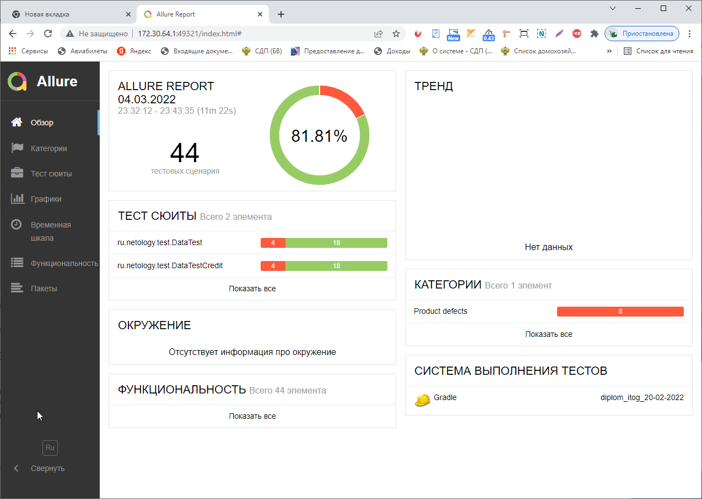
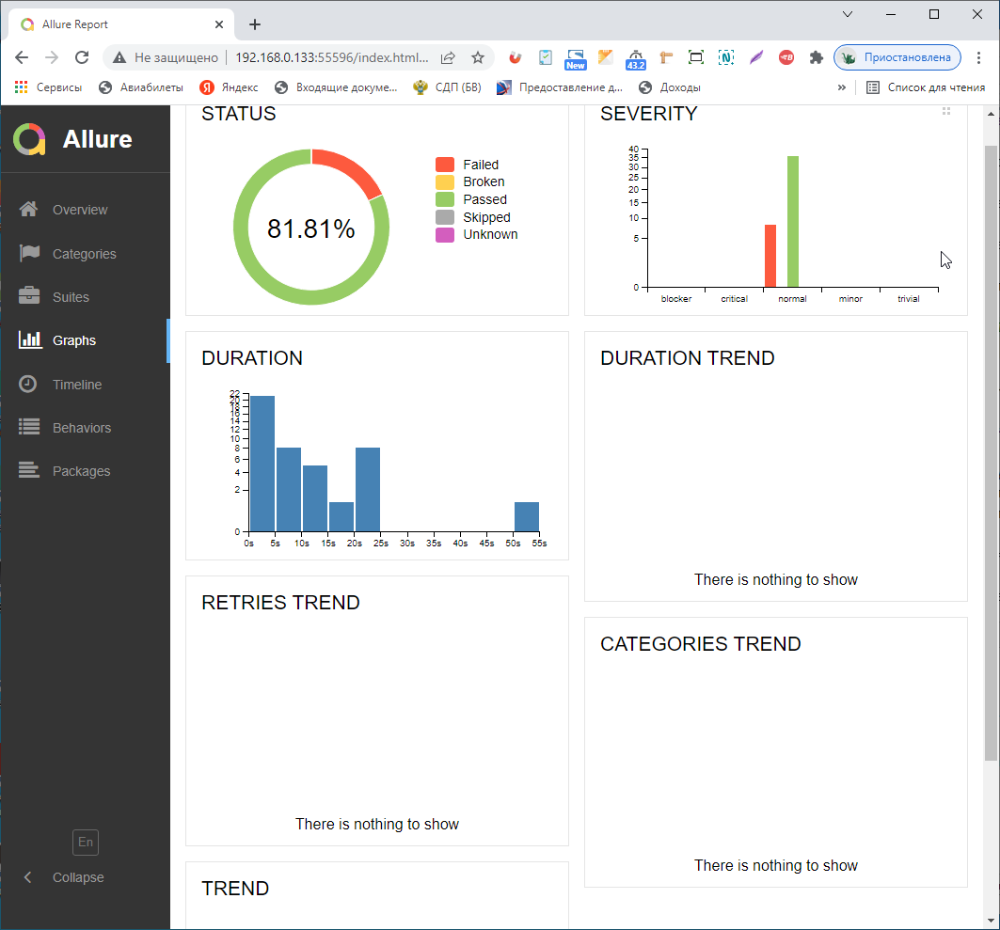

### Отчет о проведенном тестировании

В проекте было предложено проведение тестирования веб-сервиса по покупке тура с помощью двух способов: оплата по дебетовой карте и выдача кредита по банковской карте.

При подготовке к автоматизации было проведено ручное исследовательское тестирование, осложненное отсутствием ТЗ, и составлен план автоматизации. 

Проведена автоматизация тестирования проекта "Путешествие дня" (функционалы оплаты по карте и покупки в кредит).

Разработано 44 тестовых сценария основного функционала (клиентской стороны пользовательского интерфейса и программно-аппаратной части веб-сервиса с учетом представленных валидных данных), из них 81.81 % успешных, 18,19 % неуспешных.

Все выявленые дефекты зафиксированы в Issues.

##### Общие рекомендации по доработке тестируемой системы. 

1. Устранить обнаруженные дефекты.
2. Для облегчения тестирования для каждого элемента предусмотреть уникальный идентификатор (css селектор).
3. Представить на тестирование помимо веб-сервиса документацию к нему (техническое задание).

======================================

*Кроме того: есть вопросы, которые не относятся к автоматизации веб-сервиса, но они могут оказать существенное влияние на принятие решения клиентами по данному предложению и деловой репутации организации, предложившей данное путешествие.*
*При отсутствии ТЗ по предлагаемому приложению невозможно было оценить правильность первичной информации, указанной на основной странице приложения, такой как:*
1. *Марракэш - правильное написание "Марракеш", находится в стране Марокко, которая окружена Атлантическим океаном и Средиземным морем и расположена в западной части Северной Африки.*
2. *33360 миль на карту - например, чтобы получить серебряную карту Аэрофлота нужно 25000 миль (возможна ошибка, и количество миль - 3360?)*
3. *Отсутствует детальная информация по остальным пунктам предложения (7 процентов на какой период; путешествие с какими условиями (количество дней, условия размещения, и т.д.))*
4. *Нет информации об условиях кредита при выборе соответствующего шага.*
5. *Для удобства клиента можно рекомендовать изменять цвет кнопок "Купить"/"Купить в кредит" при принятии соответствующего решения.*
 